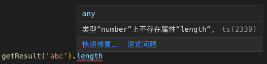

同学你好，我是 TypeScript，如果你觉得我是 JavaScript 的孪生兄弟，或者觉得我是前端圈新扶持起来的太子，那你可能对我是有点误解了。其实我并不是一个新的语言，用大家公认的说法，我是 JavaScript 的超集，你可以理解为，我是加了一身装备铭文的进化版 JavaScript。JavaScript 有的，我都有，而且做得更好。JavaScript 没有的，我也有，而且我是在很长一段时间内不会被 JavaScript 赶上的。

<!-- more -->

> 既然我已经踏上这条道路，那么，任何东西都不应妨碍我沿着这条路走下去。 ——康德

:::warning 或许你对 TypeScript 了解还不多，或许还有很多疑问，比如：

- 学 TypeScript 是不是就不需要学 JavaScript 了？
- Vue 用 TypeScript 改写发布 3.0 后是不是不用 TypeScript 不行？
- TypeScript 靠谱吗？
- …
  :::

诸如此类疑惑，导致你一直对它犹豫不决，那么本节我将代替 TypeScript 向你做一个自我介绍

## TypeScript 介绍

虽然我作为超集，但是我始终紧跟 ECMAScript 标准，所以 ES6/7/8/9 等新语法标准我都是支持的，而且我还在语言层面上，对一些语法进行拓展。比如新增了枚举(Enum)这种在一些语言中常见的数据类型，对类(Class)实现了一些 ES6 标准中没有确定的语法标准等等。

如果你是一个追赶技术潮流的开发者，那你应该已经将 ES6/7/8/9 语法用于开发中了。但是要想让具有新特性的代码顺利运行在非现代浏览器，需要借助 Babel 这种编译工具，将代码转为 ES3/5 版本。而我，可以完全不用 Babel，就能将你的代码编译为指定版本标准的代码。这一点，我可以说和 JavaScript 打了个平手。

另外我的优势，想必你也略有耳闻了那就是我强大的类型系统。这也是为什么造世主给我起名 TypeScript。如果你是一名前端开发者，或者使用过 JavaScript 进行开发，那么你应该知道，JavaScript 是在运行的时候，才能发现一些错误的，比如：

:::danger JavaScript 是在运行的时候，才能发现一些错误

- 访问了一个对象没有的属性；
- 调用一个函数却少传了参数；
- 函数的返回值是个字符串你却把它当数值用了；
- …
  :::

这些问题在我这里都不算事。我强大的类型系统可以在你编写代码的时候，就检测出你的这些小粗心。先来简单看
下我工作的样子：


interface 定义的叫接口，它定义的是对结构的描述。下面的 info 使用 ES6 的新关键字 const 定义，通过 info: Info 指定 info 要实现 Info 这个结构，那 info 必须要包含 name 和 age 这两个字段。实际代码中却只有 name 字段，所以你可以看到 info 下面被红色波浪线标记了，说明它有问题。当你把鼠标放在 info 上时，VSCode 编辑器会做出如下提示：


如果上面这个小例子中你有很多概念都不了解，没关系，在后面的章节都会讲到。

配合[VSCode](https://github.com/Microsoft/vscode)这类编辑器，你可以借助编辑器的提示愉快地使用 TypeScript。另外值得一提的是，深受前端开发者喜爱的 VSCode 也是使用 TypeScript 开发的哦。

很多后端开发者，在做了很久的后端开发，习惯了 C++、Java 这些语言后，可能对我会有很多误解。就拿一个函数重载来说吧，在别的这些语言里，你可以定义多个同名函数，然后不同点在于参数个数、参数类型和函数体等，你可以给同一个函数传入不同参数，编译器就会知道你要调用的是哪个函数体；而我，也是有函数重载的概念的，只不过，我的重载是为了帮助编译器知道，你给同一个函数传入不同参数，返回值是什么情况；在 JavaScript 中，我们如果有一个函数，要根据传入参数不同，执行不同的逻辑，是需要自己在函数体内自行判断的。比如下面这个 JavaScript 书写的例子：

```js
const getResult = (input) => {
  if (typeof input === 'string') return input.length
  else if (typeof input === 'number') return input.toString()
  else return input
}
```

这个例子很简单。如果输入的值是字符串类型，返回这个字符串的长度；如果是数值类型，返回这个数值变成字符串的结果；如果都不是，原样返回。可以看到，输入不同类型的值，返回的结果类型是不一样的。所以如果你要使用这个函数的返回值，就可能一不小心用错，比如输入 `123` ，应该返回字符串 `‘123’` 。如果你在结果上调用 toFixed 方法，如 `getResult(123).toFixed()` ，运行后就会报错，因为字符串是没有这个方法的。如果你使用我来书写，结果就不同了，我会在你写代码的时候就告诉你。来看怎么使用我来书写上面的例子：

```ts
function getResult(input: string): number
function getResult(input: number): string
function getResult<T>(input: T): T
function getResult(input: any): any {
  if (typeof input === 'string') return input.length
  else if (typeof input === 'number') return input.toString()
  else return input
}
```

前三行组成了函数重载，第四行开始是实际函数体，之后你再调用 `getResult` 来看下效果：


这里输入 123 结果应该是字符串’123’，结果访问 toFixed 方法，字符串是没有这个方法的。



这里输入字符串’abc’，返回应该是他的长度数值 3，结果访问它的 length 属性，数值是没有 length 属性的。


这里你传入一个对象，既不是字符串也不是数值，所以原样返回这个对象，编译器就知道你的 res 是对象 `{ a: ‘a’, b: ‘b’ }` 啦。所以当你输入 res 然后输入 `.` 后，VSCode 就会给你列出有哪些属性可以访问。

是不是和你理解的函数重载有点不一样？所以一定要注意哦，不要用学习其他语言的思维来认识我哦，否则你会钻牛角尖的。上面例子的语法你可以不用在意，因为都会详详细细地给你讲哒。

对了，另外还有一个我的好搭档，TSLint，也是追求极致的你不可或缺的。它和 ESLint 相似，都是能够对你的代码起到约束和提示作用，特别是团队协作的项目中，使用它可以让你们多个开发者都能够遵循相同的代码规范——大到各种语法，小到标点空格。搭配使用 VSCode 和 TSLint，再加上我强大的类型系统，写代码简直不要太嗨~

好了，向你介绍得差不多了，相信你对我已经有了一个大致的了解。下面向你客观地介绍下，我的发展趋势以及你为什么要与我为伴。

相信你在听完 TypeScript 的自我介绍之后，它的亮点你已经了解一二了。或许你还有些顾虑，毕竟学习 TypeScript 是需要时间的，你可能会担心 TypeScript 像 CoffeeScript 一样，随着 ES 标准 的不断更新，渐渐退出大家的视线。下面让我们来看下 TypeScript 的发展趋势，来打消你的顾虑，同时让你对它有进一步的了解。

我们都知道 TypeScript 最主要的亮点是它的类型系统，这使得在编写代码的时候就能够检测到一些错误。而 JavaScript 是一门动态脚本语言，它不需要编译成二进制代码运行。Node 服务端代码也不需编译即可在服务器起一个服务，你甚至可以直接在服务器修改你的服务代码然后重启就可以，不需要编译等操作。这一切特点使得 JavaScript 的所有调试都需要在运行时才能进行，在编写代码的时候很多问题是无法提前知晓的，而且就
JavaScript 目前的使用场景来看，它在至少很长一段时间内会保持这样的特点。

而 TypeScript 和 JavaScript 不同的就是，它可以在你编写代码的时候，就对一些错误进行提示，还能在你使用某个数据的时候，为你列出这个数据可以访问的属性和方法。在 TypeScript 的自我介绍中我们已经看过几个简单的例子，想必你也知道它实现这些的效果了。当我们的项目较为庞大，需要由多人合作开发时，多人协作是需要沟通成本和 review 成本的。一些接口的定义，一些方法的使用，都可能因为个人习惯或沟通不畅导致逻辑实现的差异。而如果引入 TypeScript，则会对一些实现进行强校验。如果不按接口实现，编译就没法通过，如果对代码质量要求较高，可以将严格检查全部打开，效果更好。

:::tip 那么哪些项目适合用 TypeScript 开发呢，我总结了几类：

- 需要多人合作开发的项目
- 开源项目，尤其是工具函数或组件库
- 对代码质量有很高要求的项目
  :::

## TypeScript 开发的经典项目

来看几个广为人知的使用 TypeScript 开发的经典项目：

- VSCode：开源的高质量代码编辑器,VSCode 使用 TypeScript 开发，所以它天生就支持 TypeScript；
- Angular & React & Vue3.0：现在三足鼎立的三个前端框架，Angular 和 React 已经使用 TypeScript 编写，而在我编写专栏的同时，Vue3.0 将使用 TypeScript 进行重构，届时三个前端框架都使用 TypeScript 编写，如果使用 TypeScript 开发将会得到很好的类型支持。也可以看出，TypeScript 已经被广为接受。当然了，你依然可以使用 JavaScript 来开发前端项目，但是相信随着 Vue3.0 发布，TypeScript 将会被越来越多的开发者所接受；
- Ant Design：使用 React 开发项目的开发者大多应该都知道蚂蚁金服开源 UI 组件库[Ant Design](https://ant.design/index-cn)，同样使用 TypeScript 进行编写。保证了代码质量的同时，也能很好地支持开发者使用 TypeScript 进行 React 项目的开发。如果你使用 Vue 进行开发，Ant Design 也提供了 Vue 版的组件库，风格和功能和 React 版的保持一致，共享单元测试和设计资源，对 TypeScript 的支持也一样很好。

TypeScript 在实现新特性的同时，时刻保持对 ES 标准的对齐。一些 ECMAScript 标准没有确定的内容，在 TypeScript 中已经率先支持了。所以在语法标准方面，可以说 TypeScript 是略微领先的，比如类的私有属性和方法。ES6 标准对类的相关概念的定义中，并没有私有属性的概念，如果想实现私有属性，需要使用一些方法 hack（可以参考阮一峰的[《ECMAScript 6 入门》- 私有方法和私有属性](http://es6.ruanyifeng.com/#docs/class#%E7%A7%81%E6%9C%89%E6%96%B9%E6%B3%95%E5%92%8C%E7%A7%81%E6%9C%89%E5%B1%9E%E6%80%A7)）；但是 TypeScript 是支持私有属性的，可以直接使用 `private` 指定一个私有属性。虽然 ECMAScript 新的提案提供了定义私有属性的方式，就是使用 `#` 来指
定一个属性是私有的，但是到目前为止现在还没有编译器支持这种语法。

以上便是对 TypeScript 的大致介绍，接下来我们来看下本小册有哪些内容。

## 知识结构

本小册共 6 大章节，6 个章节的内容主要为：

<div class="vt-box-container next-steps">
  <a class="vt-box" href="/notes/Typescript-full-interpretation/01-Guide-hello-typescript.html">
    <p class="next-steps-link">1. 入门准备</p>
  </a>
  <a class="vt-box" href="/notes/Typescript-full-interpretation/04-types-you-have-seen-in-the-eight-JS.html">
    <p class="next-steps-link">2. 基础部分</p>
  </a>
  <a class="vt-box" href="/notes/Typescript-full-interpretation/14-type-inference,-see-how-TS-understands-you.html">
    <p class="next-steps-link">3. 进阶部分</p>
  </a>
</div>

<div class="vt-box-container next-steps">
  <a class="vt-box" href="/notes/Typescript-full-interpretation/26-Encapsulating-code-with-modules">
    <p class="next-steps-link">4. 知识整合</p>
  </a>
  <a class="vt-box" href="/notes/Typescript-full-interpretation/31-Look-at-the-tsconfig-json-configuration-one-by-one">
    <p class="next-steps-link">5. 项目配置及书写声明文件</p>
  </a>
  <a class="vt-box" href="/notes/Typescript-full-interpretation/34-Conclusion">
    <p class="next-steps-link">6. 写在最后</p>
  </a>
</div>

好了，在听完 TypeScript 的自我介绍和发展趋势的了解之后，让我们一起愉快地进入 TypeScript 的学习中去吧。
