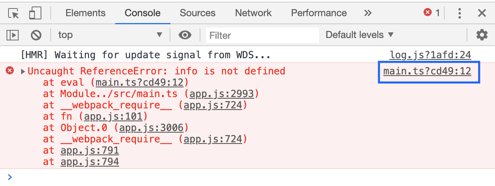
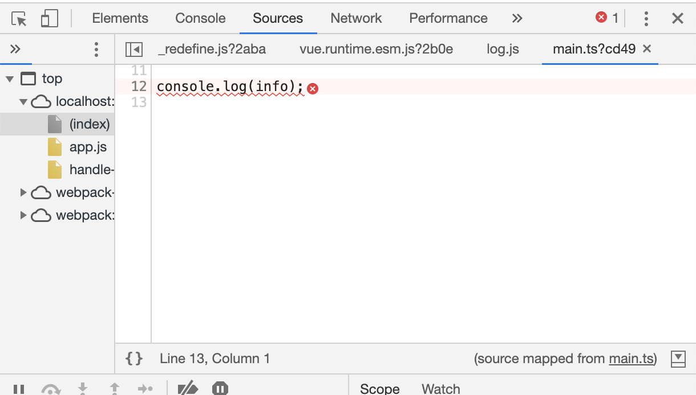
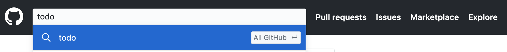
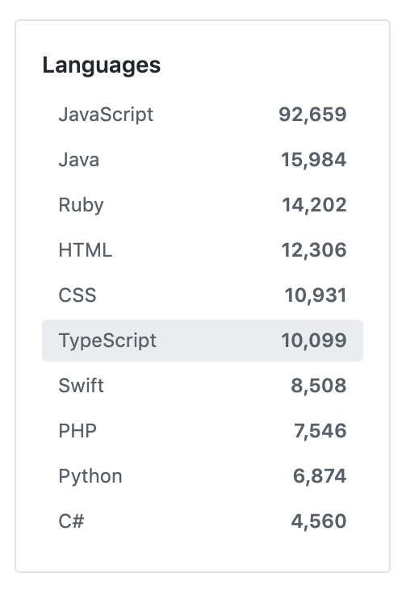

如果你看过了本专栏的大纲，那你应该会有一种，哇，官方文档里列出的知识基本都讲了，这个专栏太细了的感觉。这一个小节我会教给大家如何去自学 TypeScript。虽然你在学习本专栏的时候，Lison 会手把手的带着你学习 TypeScript 的语法和实战。但我还是想给你讲讲如何自学 TypeScript，在授你以鱼之前也会授你以渔的，这样 TypeScript 即使更新了，你也能毫无压力地迎接它的新特性。好，接下来让我们开始吧。

<!-- more -->

> 理想必须要人们去实现它，它不但需要决心和勇敢而且需要知识。 ——吴玉章

## 1 学会看文档

[英文官方文档](http://www.typescriptlang.org/docs/home.html)始终是及时更新的。但即便是官方的文档，有一些更新在更新日志里写了，而新手指南里却没有及时同步更新，所以有时看指南也会遇到困惑，就是文档里写的和你实际验证的效果不一样。遇到这种问题，首先确定你使用的 TypeScript 版本，然后去更新日志里根据不同版本找对这部分知识的更新记录。如果找到了，看下这是在哪个版本做的升级；如果你不放心，可以把 TypeScript 版本降到这个版本之前的一个版本，再验证一下。

TypeScript 是有一个[中文文档](http://www.patrickzhong.com/TypeScript/)的，但是这个文档只是对英文文档的翻译。官方文档中的小疏漏，这个文档也没有做校验，而且更新是有点滞后的。所以想了解 TypeScript 的最新动态，还是要看英文官方文档的。不过我们还是要感谢提供中文文档的译者，这对于英文不是很好的开发者帮助还是很大的。

## 2 学会看报错

我们在前面的例子中展示了 TypeScript 在编写代码的时候如何对错误进行提示。后面我们讲到项目搭建的时候，会使用 TSLint 对代码风格进行规范校验，根据 TSLint 配置不同，提示效果也不同。如果我们配置当书写的代码不符合规范，使用 error 级别来提示时，会和 TypeScript 编译报错一样，在问题代码下面用红色波浪线标出，鼠标放上去会有错误提示。所有如果我们使用了 TSLint，遇到报错的时候，首先要区分是 TSLint 报错还是 TS 报错，来看下如何区分：

上面这个报错可以从红色方框中看到，标识了 `tslint` ，说明它是 TSLint 的报错。后面括号里标的是导致这条报错的规则名，规则可以在 `tslint.json` 文件里配置。关于 TSLint 的使用，我们会在搭建开发环境一节讲解。示例中这条报错是因为 `no-console` 这个规则，也就是要求代码中不能有 `console` 语句，但是我们在开发时使用 console 来进行调试是很常见的，所以你可以通过配置 TSLint 关闭这条规则，这样就不会报错了。但我们应该遵守规范，当我们决定引入 TSLint 的时候，就说明这个项目对代码质量有更高的要求，我们不应该在书写代码遇到 TSLint 报错就修改规则，而是应该根据规则去修改代码。

上面这个报错可以从红色方框中看到，标识了 `ts` ，说明它是 TypeScript 编译器报的错误。在我们书写代码的时候，通过强类型系统，编译器可以在这个阶段就检测到我们的一些错误。后面括号里跟着的 `2322` 是错误代码，所有的错误代码你可以在文档的[错误信息列表](https://www.tslang.cn/docs/handbook/error.html)中查看。不过你一般并不需要去看文档，因为这里都会给你标出这个错误码对应的错误提示，而且这个错误信息根据你的编辑器语言可以提示中文错误信息。很明显这个错误是因为我们给 name 指定了类型为 string 字符串 类型，而赋给它的值是 123 数值类型。

上面两种是在编写代码的时候就会遇到的错误提示。还有一种就是和 JavaScript 一样的，在运行时的报错，这种错误需要在浏览器控制台查看。如果你调试的是 node 服务端项目，那你要在终端查看。来看这个例子：

当我在代码中打印一个没有定义的变量时，在书写代码的时候会做提示，且当程序运行起来时，在浏览器控制台也可以看到报错。你可以打开浏览器的开发者工具(Windows 系统按 F12，Mac 系统按 control+option+i)，在 Console 栏看到错误提示：

红色语句即错误信息。下面红色 `at` 后面有个文件路径 `main.ts` ，蓝色框中圈出的也是个文件路径，表示这个错误出现在哪个文件。这里是出现在 `main.ts` 中，问号后面的 `cd49:12` 表示错误代码在 12 行，点击这个路径即可跳到一个该文件的浏览窗口：

在这里我们就能直接看到我们的错误代码被红色波浪线标记了，这样你修改起错误来就很明确知道是哪里出错了。

## 3 学会看声明文件

声明文件我们会在后面讲。我们知道原来没有 TypeScript 的时候，有很多的 JS 插件和 JS 库，如果使用 TypeScript 进行开发再使用这些 JS 编写的插件和库，就得不到类型提示等特性的支持了，所以 TypeScript 支持为 JS 库添加声明文件，以此来提供声明信息。我们使用 TypeScript 编写的库和插件编译后也是 JS 文件，所以在编译的时候可以选择生成声明文件，这样再发布，使用者就依然能得到 TypeScript 特性支持。一些 JS 库的作者已经使用 TypeScript 进行了重写，有些则是提供了声明文件，一些作者没有提供声明文件的，大部分库都有社区的人为他们补充了声明文件，如果使用了自身没有提供声明文件的库时，可以使用 `npm install @types/{模块名}` 来安装，或者运用我们后面讲到的知识自行为他们补充。

看这些库的声明文件能够帮你提高对 TypeScript 的了解程度。因为可能你在实际开发中所接触的场景不是很复杂，运用到的 TypeScript 语法点也不是很全面，所以就会导致经常用的你很熟悉，不经常用的慢慢就忘掉了，甚至有的自始至终你都没有使用过。很多知识你只看理论知识，或者看简单的例子，是没法真正理解并深刻记忆的，只有在实际场景中去使用一下，才能加深理解。所以我们可以从这些库的声明文件入手，还有就是从 TypeScript 内置的 lib 声明文件入手。

安装好 TypeScript 后，我们可以在 node_modules 文件夹下找到 typescript 文件夹，里面有个 lib 文件夹，lib 文件夹根目录下有很多以 `lib.` 开头的 `.d.ts` 文件。这些文件，就是我们在开发时如果需要用到相关内容，需要在 `tsconfig.json` 文件里配置引入的库的声明文件，这个配置我们后面会讲到。先简单举个例子，比如我们要使用 DOM 操作相关的语法，比如我们获取了一个 button 按钮的节点，那么我们就可以指定它的类型为 HTMLButtonElement，那么我们再访问这个节点的属性的时候，编辑器就会给你列出 button 节点拥有的所有属性方法了；如果我们要用到这个类型接口，那我们就需要引入 `lib.dom.d.ts` 也就是 dom 这个 lib。这里如果你对一些提到的概念不明白，你可以先忽略，因为后面都会讲到。这里我要告诉你的就是，你应该学着看这些声明文件，看看它们对于一些内容的声明是如何定义的，能够帮你见识到各种语法的运用。

## 4 学会搜问题和提问

实际开发中，有时候你难免会遇到一些文档里没有提到的各种各样的奇怪问题。解决问题的途径有很多，请教有经验的人是最简单的啦，但前提是你身边有个随叫随到的大神，可这样的人一般很少有，所以还是看看我推荐给你的解决问题的途径吧：

- 途径 1：百度 or Google
  一般来说大众的问题都能在百度找到，但是开发问题 Google 能够帮你找到一些高质量的国外答疑帖，所以这两个搜索引擎你都可以试试，这个途径是你遇到问题之后的首选。
- 途径 2：看 issue
  TypeScript 的问答确实要比很多框架或者基础知识的少很多。如果搜索引擎找不到，你可以到 github 上 TypeScript 的官方仓库，在 issues 里可以通过问题关键字搜索，看看有没有人反馈过这个问题。这里要注意，搜索的是关键字，而不是把你的报错信息完整输进去，这样基本很难搜到。你应该挑选出错误信息中比较具有代表性的单词进行搜索，因为这和搜索引擎不一样，issues 提供的搜索还不是很强大。
- 途径 3：去提问
  如果上面两个途径都没找到，你只能自行提问了，这也是一个造福后人的方法。比较受欢迎的提问网站：国内你可以试试 segmentFault，国外可以试试 stackOverflow，还有就是 TypeScript 的 issues 了。但要注意如果在 stackOverflow 和 issues 中提问，最好最好用英文。

## 5 看优秀项目源码

这个学习方法是比较高阶的了，看一些优秀的开源项目源码可以为你提供思路。你还可以借鉴到同一个逻辑不同人的实现方式。源码去哪里找呢，当然首选是 Github 了，进入 Github 后，你可以在顶部的搜索栏搜索你想要找的项目关键字，比如你想找个 Todo 应用的项目源码，那就搜"todo"。然后在语言栏选择 TypeScript，这样就会筛选出使用 TypeScript 编写的项目：

最后选择 star 较多的项目，说明这个项目受到了更多人的认可：

好了，以上就是自学 TypeScript 的一些方法途径。当然了，我们的 TypeScript 知识还是会由我带着大家一起学习哒，所以只要跟紧了别掉队，不怕你学不会。
