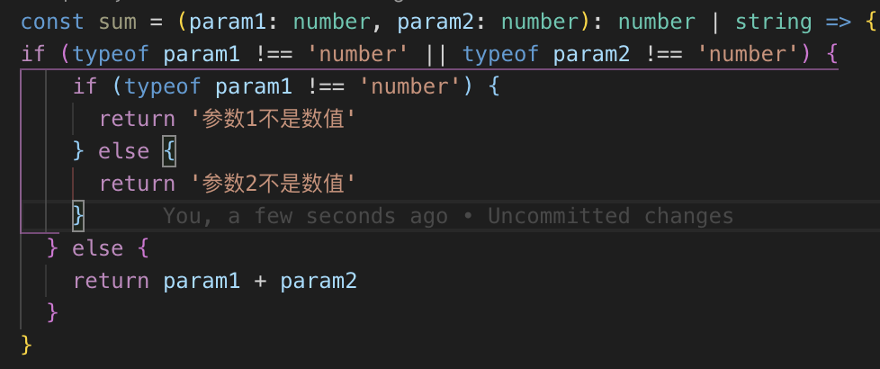

这节课我们要做的就是在砍柴之前先磨刀，学习如何借助 VSCode 愉快高效地开发 TypeScript 项目，我们来一步一
步让 VSCode 对 TypeScript 的支持更强大。如果你已经习惯了使用别的编辑器，那你也可以自行搜索下，本节课提
到的内容在你使用的编辑器是否有对应的替代品。

<!-- more -->

> 宝剑锋从磨砺出，梅花香自苦寒来。 ——佚名

## 1. 安装和基本配置

如果你还没有使用过 [VSCode](https://code.visualstudio.com/)，当然先要去官网下载了，下载安装我就不多说了，安装好之后，我们先来配置几个
基本的插件。

- 汉化

如果你英语不是很好，配置中文版界面是很有必要的，安装个插件就可以了。打开 VSCode 之后在编辑器左侧找到
这个拓展按钮，点击，然后在搜索框内搜索关键字"Chinese"，这里图中第一个插件就是。直接点击 install 安装，安
装完成后重启 VSCode 即可。


- 编辑器配置

format on save


- 提升开发体验

  - [Auto Close Tag](https://marketplace.visualstudio.com/items?itemName=formulahendry.auto-close-tag) 插件会自动帮你补充 HTML 闭合标签，比如你输完 `<button>` 的后面的尖括号后，插件会自动帮你补
    充 `</button>` ；

  - [Auto Rename Tag](https://marketplace.visualstudio.com/items?itemName=formulahendry.auto-rename-tag)插件会在你修改 HTML 标签名的时候，自动帮你把它对应的闭标签同时修改掉；
  - [Bracket Pair Colorizer](https://marketplace.visualstudio.com/items?itemName=CoenraadS.bracket-pair-colorizer) 插件会将你的括号一对一对地用颜色进行区分，这样你就不会被多层嵌套的括号搞晕了，来
    看看它的样子：
    
  - [Guides](https://marketplace.visualstudio.com/items?itemName=spywhere.guides) 插件能够帮你在代码缩进的地方用竖线展示出索引对应的位置，而且点击代码，它还会将统一代码块范围的代码用统一颜色竖线标出，如图：
    

## 2 常用功能

- 终端
  在 VSCode 中有终端窗口，点击菜单栏的【查看】-【终端】，也可以使用快捷键 ”control+`“ 打开。这样可以直接在
  编辑器运行启动命令，启动项目，边写代码边看报错。

- 用户代码片段
  一些经常用到的重复的代码片段，可以使用 `用户代码片段` 配置，这样每次要输入这段代码就不用一行一行敲了，直
  接输入几个标示性字符即可。在 VSCode 左下角有个设置按钮，点击之后选择【用户代码片段】，在弹出的下拉列
  表中可以选择【新建全局代码片段文件】，这样创建的代码片段是任何项目都可用的；可以选择【新建"项目名"文
  件夹的代码片段文件】，这样创建的代码片段只在当前项目可用。创建代码片段文件后它是一个类似于 json 的文
  件，文件有这样一个示例：

  ```json
  {
    // Place your global snippets here. Each snippet is defined under a snippet name and has a scope, prefix, body and
    // description. Add comma separated ids of the languages where the snippet is applicable in the scope field. If scope
    // is left empty or omitted, the snippet gets applied to all languages. The prefix is what is
    // used to trigger the snippet and the body will be expanded and inserted. Possible variables are:
    // $1, $2 for tab stops, $0 for the final cursor position, and ${1:label}, ${2:another} for placeholders.
    // Placeholders with the same ids are connected.
    // Example:
    // "Print to console": {
    // 	"scope": "javascript,typescript",
    // 	"prefix": "log",
    // 	"body": [
    // 		"console.log('$1');",
    // 		"$2"
    // 	],
    // 	"description": "Log output to console"
    // }
  }
  ```

  我们来看一下其中的几个关键参数：

  - `Print to console` 是要显示的提示文字
  - `scope` 是代码片段作用的语言类型
  - `prefix` 是你输入这个名字之后，就会出现这个代码片段的选项回车即可选中插入
  - `body` 就是你的代码片段实体
  - `$1` 是输入这个片段后光标放置的位置，这个$1 不是内容，而是一个占位
  - `description` 是描述。

  **生成代码片段的线上工具：[snippet generator](https://snippet-generator.app/)**

## 3 搭建开发环境

使用 [vite](https://cn.vitejs.dev/), 来搭建我们的开发环境

具体流程查看 Vite 官方文档，使用的模板预设是 [vanilla-ts](https://vite.new/vanilla-ts)

现在我们前端项目的搭建就大功告成了，我们后面的课程都会在这个基础上进行示例的演示。大家最好都自己操作
一遍，把开发环境的搭建流程走一下，如果中间遇到了报错仔细看一下报错信息。下节课开始我们就正式的步入
TypeScript 的学习中了，我们下节课见。
