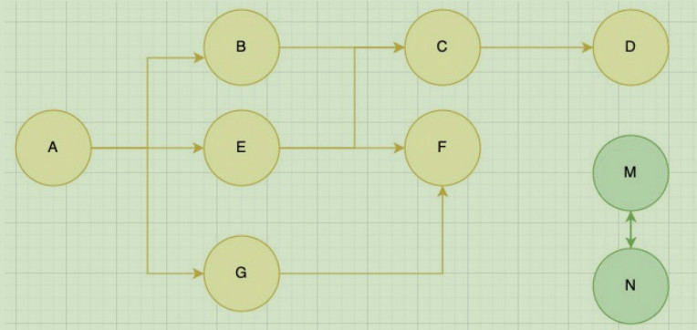
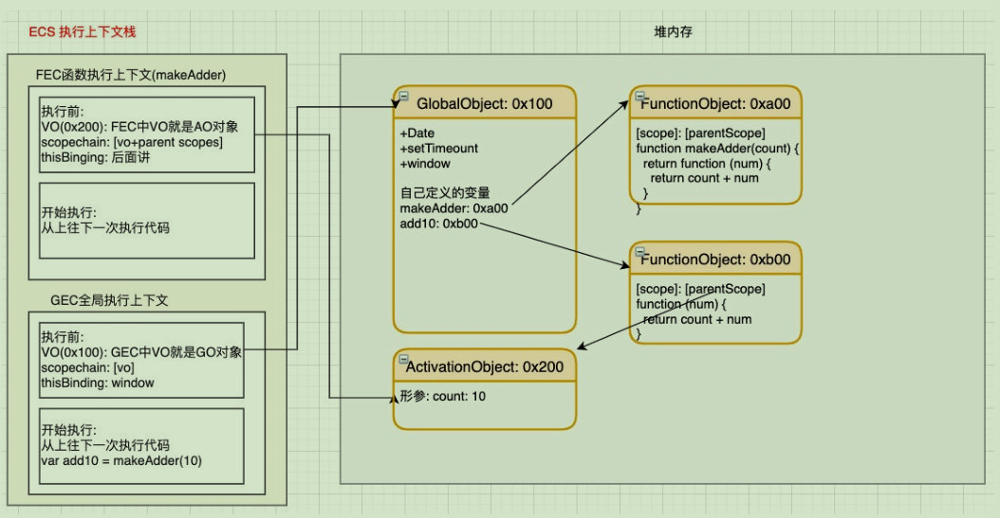
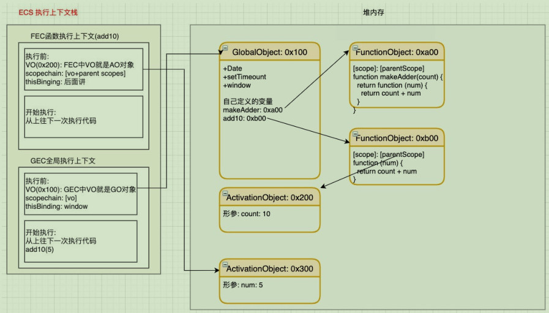

不管什么样的编程语言，在代码的执行过程中都是需要给它分配内存的，不同的是某些编程语言需要我们自己手动
的管理内存，某些编程语言会可以自动帮助我们管理内存：

<!-- more -->

## 认识内存管理

不管以什么样的方式来管理内存，内存的管理都会有如下的生命周期：

- 第一步：分配申请你需要的内存（申请）；
- 第二步：使用分配的内存（存放一些东西，比如对象等）；
- 第三步：不需要使用时，对其进行释放；

不同的编程语言对于第一步和第三步会有不同的实现：

- 手动管理内存：比如 C、C++，包括早期的 OC，都是需要手动来管理内存的申请和释放的（malloc 和 free 函
  数）；
- 自动管理内存：比如 Java、JavaScript、Python、Swift、Dart 等，它们有自动帮助我们管理内存；

我们可以知道 JavaScript 通常情况下是不需要手动来管理的。JavaScript 会在定义变量时为我们分配内存。

但是内存分配方式是一样的吗？

JS 对于基本数据类型内存的分配会在执行时，
直接在栈空间进行分配；JS 对于复杂数据类型内存的分配会在堆内存
中开辟一块空间，并且将这块空间的指针返
回值变量引用；


## JS 的垃圾回收

因为内存的大小是有限的，所以当内存不再需要的时候，我们需要对其进行释放，以便腾出更多的内存空间。

在手动管理内存的语言中，我们需要通过一些方式自己来释放不再需要的内存，比如 free 函数：

- 但是这种管理的方式其实非常的低效，影响我们编写逻辑的代码的效率；
- 并且这种方式对开发者的要求也很高，并且一不小心就会产生内存泄露；

所以大部分现代的编程语言都是有自己的垃圾回收机制：

- 垃圾回收的英文是 Garbage Collection，简称 GC；
- 对于那些不再使用的对象，我们都称之为是垃圾，它需要被回收，以释放更多的内存空间；
- 而我们的语言运行环境，比如 Java 的运行环境 JVM，JavaScript 的运行环境 js 引擎都会内存 垃圾回收器；
- 垃圾回收器我们也会简称为 GC，所以在很多地方你看到 GC 其实指的是垃圾回收器；

但是这里又出现了另外一个很关键的问题：GC 怎么知道哪些对象是不再使用的呢？这里就要用到 GC 的算法了

## 常见的 GC 算法 – 引用计数

引用计数：当一个对象有一个引用指向它时，那么这个对象的引用就+1，当一个对象的引用为 0 时，这个对象就可以被销
毁掉；这个算法有一个很大的弊端就是会产生循环引用；

这个算法有一个很大的弊端就是会产生循环引用；


## 常见的 GC 算法 – 标记清除

标记清除：

这个算法是设置一个根对象（root object），垃圾回收器会定期从这个根开始，找所有从根开始有引用到的对象，对
于哪些没有引用到的对象，就认为是不可用的对象；

这个算法可以很好的解决循环引用的问题；



JS 引擎比较广泛的采用的就是标记清除算法，当然类似于 V8 引擎为了进行更好的优化，它在算法的实现细节上也会结合
一些其他的算法。

## 让人迷惑的闭包

闭包是 JavaScript 中一个非常容易让人迷惑的知识点：

这几天看到有同学在深入 JS 高级的交流群中发了这么一张图片；并且闭包也是群里面大家讨论最多的一个话题；


闭包确实是 JavaScript 中一个很难理解的知识点，接下来我们就对其一步步来进行剖析，看看它到底有什么神奇之
处

## JS 中函数是一等公民

在 JavaScript 中，函数是非常重要的，并且是一等公民：那么就意味着函数的使用是非常灵活的；函数可以作为另外一个函数的参数，也可以作为另外一个函数的返回值来使用；

- 自己编写高阶函数
- 使用内置的高阶函数

## JS 中闭包的定义

这里先来看一下闭包的定义，分成两个：在计算机科学中和在 JavaScript 中。

### 在计算机科学中对闭包的定义（维基百科）

- 闭包（英语：Closure），又称词法闭包（Lexical Closure）或函数闭包（function closures）；
- 是在支持 头等函数 的编程语言中，实现词法绑定的一种技术；
- 闭包在实现上是一个结构体，它存储了一个函数和一个关联的环境（相当于一个符号查找表）；
- 闭包跟函数最大的区别在于，当捕捉闭包的时候，它的 自由变量 会在补充时被确定，这样即使脱离了捕捉时的上下文，它也能照常运行；

闭包的概念出现于 60 年代，最早实现闭包的程序是 Scheme，那么我们就可以理解为什么 JavaScript 中有闭包：因为 JavaScript 中有大量的设计是来源于 Scheme 的；

### 我们再来看一下 MDN 对 JavaScript 闭包的解释

- 一个函数和对其周围状态（lexical environment，词法环境）的引用捆绑在一起（或者说函数被引用包围），这样的组合就是闭包（closure）；
- 也就是说，闭包让你可以在一个内层函数中访问到其外层函数的作用域；
- 在 JavaScript 中，每当创建一个函数，闭包就会在函数创建的同时被创建出来；

### 那么我的理解和总结

- 一个普通的函数 function，如果它可以访问外层作用于的自由变量，那么这个函数就是一个闭包；
- 从广义的角度来说：JavaScript 中的函数都是闭包；
- 从狭义的角度来说：JavaScript 中一个函数，如果访问了外层作用于的变量，那么它是一个闭包；

## 闭包的访问过程

如果我们编写了如下的代码，它一定是形成了闭包的：

```js
function makeAdder(count) {
  return function (num) {
    return count + num
  }
}

var add10 = makeAdder(10)
console.log(add10(5))
```



## 闭包的执行过程

那么函数继续执行呢？

这个时候 makeAdder 函数执行完毕，正常情况下我们的 AO 对象会被释放；但是因为在 0xb00 的函数中有作用域引用指向了这个 AO 对象，所以它不会被释放掉；



## 闭包的内存泄露

那么我们为什么经常会说闭包是有内存泄露的呢？

在上面的案例中，如果后续我们不再使用 add10 函数了，那么该函数对象应该要被销毁掉，并且其引用着的父
作用域 AO 也应该被销毁掉；

但是目前因为在全局作用域下 add10 变量对 0xb00 的函数对象有引用，而 0xb00 的作用域中 AO（0x200）有引
用，所以最终会造成这些内存都是无法被释放的；

所以我们经常说的闭包会造成内存泄露，其实就是刚才的引用链中的所有对象都是无法释放的；

那么，怎么解决这个问题呢？

因为当将 add10 设置为 null 时，就不再对函数对象 0xb00 有引用，那么对应的 AO 对象 0x200 也就不可达了；

在 GC 的下一次检测中，它们就会被销毁掉；

```js
add10 = null
```

## 闭包的内存泄漏测试

```js
function testArray() {
  var arr = new Array(1024 * 1024).fill(1)
  return function () {
    console.log(arr.length)
  }
}

var arrFns = []

for (var i = 0; i < 100; i++) {
  setTimeout(() => {
    arrFns.push(testArray())
  }, 10000)
}

setTimeout(() => {
  for (var i = 0; i < 50; i++) {
    setTimeout(() => {
      arrFns.pop()
    }, 5000)
  }
}, 10000)
```


## AO 不使用的属性

我们来研究一个问题：AO 对象不会被销毁时，是否里面的所有属性都不会被释放？

下面这段代码中 name 属于闭包的父作用域里面的变量；

我们知道形成闭包之后 count 一定不会被销毁掉，那么 name 是否会被销毁掉呢？

这里我打上了断点，我们可以在浏览器上看看结果；

```js
function makeAdder(count) {
  let name = 'why'
  return function (num) {
    debugger
    return count + num
  }
}

const add10 = makeAdder(10)
console.log(add10(5))
console.log(add10(8))
```
