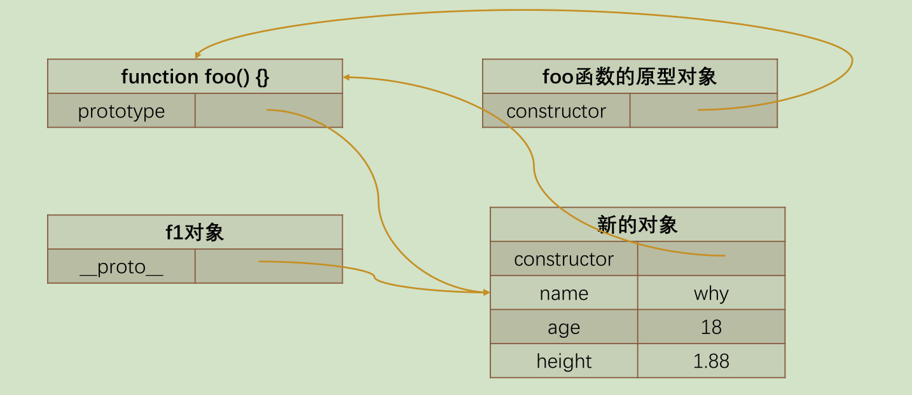

如果我们现在希望创建一系列的对象：比如 Person 对象;包括张三、李四、王五、李雷等等，他们的信息各不相同；那么采用什么方式来创建比较好呢？

目前我们已经学习了两种方式：new Object 方式；字面量创建的方式；

<!-- more -->

## 创建多个对象的方案

```js
var p1 = {
  name: '张三',
  age: 18,
  height: 1.88,
  address: '广州市',
  eating: function () {
    console.log(this.name + '在吃东西~')
  },
  running: function () {
    console.log(this.name + '在跑步~')
  },
}

var p2 = {
  name: '李四',
  age: 20,
  height: 1.98,
  address: '北京市',
  eating: function () {
    console.log(this.name + '在吃东西~')
  },
  running: function () {
    console.log(this.name + '在跑步~')
  },
}

var p3 = {
  name: '王五',
  age: 30,
  height: 1.78,
  address: '上海市',
  eating: function () {
    console.log(this.name + '在吃东西~')
  },
  running: function () {
    console.log(this.name + '在跑步~')
  },
}
```

这种方式有一个很大的弊端：创建同样的对象时，需要编写重复的代码；

## 创建对象的方案 – 工厂模式

我们可以想到的一种创建对象的方式：工厂模式

工厂模式其实是一种常见的设计模式；通常我们会有一个工厂方法，通过该工厂方法我们可以产生想要的对象；

```js
// 工厂模式: 工厂函数
function createPerson(name, age, height, address) {
  var p = {}
  p.name = name
  p.age = age
  p.height = height
  p.address = address

  p.eating = function () {
    console.log(this.name + '在吃东西~')
  }

  p.running = function () {
    console.log(this.name + '在跑步~')
  }

  return p
}

var p1 = createPerson('张三', 18, 1.88, '广州市')
var p2 = createPerson('李四', 20, 1.98, '上海市')
var p3 = createPerson('王五', 30, 1.78, '北京市')

// 工厂模式的缺点(获取不到对象最真实的类型)
console.log(p1, p2, p3)
```

## 认识构造函数

工厂方法创建对象有一个比较大的问题：我们在打印对象时，对象的类型都是 Object 类型;

但是从某些角度来说，这些对象应该有一个他们共同的类型；下面我们来看一下另外一种模式：构造函数的方式；

我们先理解什么是构造函数？

构造函数也称之为构造器（constructor），通常是我们在创建对象时会调用的函数；在其他面向的编程语言里面，构造函数是存在于类中的一个方法，称之为构造方法； 但是 JavaScript 中的构造函数有点不太一样；

JavaScript 中的构造函数是怎么样的？

构造函数也是一个普通的函数，从表现形式来说，和千千万万个普通的函数没有任何区别；那么如果这么一个普通的函数被使用 new 操作符来调用了，那么这个函数就称之为是一个构造函数；

```js
function foo() {
  console.log('foo~, 函数体代码')
}

// foo就是一个普通的函数
// foo()

// 换一种方式来调用foo函数: 通过new关键字去调用一个函数, 那么这个函数就是一个构造函数了
var f1 = new foo()
console.log(f1)
```

那么被 new 调用有什么特殊的呢？

## new 操作符调用的作用

如果一个函数被使用 new 操作符调用了，那么它会执行如下操作：

1. 在内存中创建一个新的对象（空对象）；
2. 这个对象内部的[[prototype]]属性会被赋值为该构造函数的 prototype 属性；（后面详细讲）；
3. 构造函数内部的 this，会指向创建出来的新对象；
4. 执行函数的内部代码（函数体代码）；
5. 如果构造函数没有返回非空对象，则返回创建出来的新对象

## 创建对象的方案 – 构造函数

我们来通过构造函数实现一下：

```js
// 规范: 构造函数的首字母一般是大写
function Person(name, age, height, address) {
  this.name = name
  this.age = age
  this.height = height
  this.address = address

  this.eating = function () {
    console.log(this.name + '在吃东西~')
  }

  this.running = function () {
    console.log(this.name + '在跑步')
  }
}

var p1 = new Person('张三', 18, 1.88, '广州市')
var p2 = new Person('李四', 20, 1.98, '北京市')

console.log(p1)
console.log(p2)
p1.eating()
p2.eating()
```

这个构造函数可以确保我们的对象是有 Person 的类型的（实际是 constructor 的属性，这个我们后续再探讨）；
但是构造函数就没有缺点了吗？构造函数也是有缺点的，它在于我们需要为每个对象的函数去创建一个函数对象实例；

```js
// 嵌套函数作预编译，每次函数调用，嵌套函数都会在内存中生成一个新的函数对象
function foo() {
  function bar() {}
  return bar
}

var fn1 = foo()
var fn2 = foo()

console.log(fn1 === fn2)
```

## 认识对象的原型

JavaScript 当中每个对象都有一个特殊的内置属性 [[prototype]]，这个特殊的对象可以指向另外一个对象。

那么这个对象有什么用呢？

当我们通过引用对象的属性 key 来获取一个 value 时，它会触发 [[Get]]的操作；这个操作会首先检查该属性是否有对应的属性，如果有的话就使用它；如果对象中没有改属性，那么会访问对象[[prototype]]内置属性指向的对象上的属性；

```js
// 原型有什么用呢?
// 当我们从一个对象中获取某一个属性时, 它会触发 [[get]] 操作
// 1. 在当前对象中去查找对应的属性, 如果找到就直接使用
// 2. 如果没有找到, 那么会沿着它的原型去查找 [[prototype]]
var obj = {}
obj.__proto__.age = 18

console.log(obj.age)
```

那么如果通过字面量直接创建一个对象，这个对象也会有这样的属性吗？如果有，应该如何获取这个属性呢？答案是有的，只要是对象都会有这样的一个内置属性；

获取的方式有两种：

- 方式一：通过对象的 `__proto__` 属性可以获取到（但是这个是早期浏览器自己添加的，存在一定的兼容性问
  题）；
  我们每个对象中都有一个 [[prototype]], 这个属性可以称之为对象的原型(隐式原型)

```js
var obj = { name: 'why' } // [[prototype]]
var info = {} // [[prototype]]

console.log(obj.__proto__) // {}
console.log(info.__proto__) // {}

// 修改隐式原型
var obj = { name: 'why', __proto__: {} }
```

- 方式二：通过 Object.getPrototypeOf 方法可以获取到；

```js
// ES5之后提供的Object.getPrototypeOf
console.log(Object.getPrototypeOf(obj))
```

## 函数的原型 prototype

那么我们知道上面的东西对于我们的构造函数创建对象来说有什么用呢？ 它的意义是非常重大的，接下来我们继续来探讨；

这里我们又要引入一个新的概念：所有的函数都有一个 prototype 的属性：(显式原型)

```js
function foo() {}

// 函数也是一个对象
// 函数作为对象来说, 它也是有[[prototype]] 隐式原型
// 函数它因为是一个函数, 所以它还会多出来一个显式原型属性: prototype
console.log(foo.prototype)

var f1 = new foo()
var f2 = new foo()

console.log(f1.__proto__ === foo.prototype) // true
console.log(f2.__proto__ === foo.prototype) // true
```

我们前面讲过 new 关键字的步骤如下：

1. 在内存中创建一个新的对象（空对象）；
2. 这个对象内部的[[prototype]]属性会被赋值为该构造函数的 prototype 属性；

那么也就意味着我们通过 Person 构造函数创建出来的所有对象的[[prototype]]属性都指向 Person.prototype：

## 创建对象的内存表现

```js
function Person() {}
var p1 = new Person()
var p2 = new Person()
```


```js
p2.__proto__.name = 'curry'
```


## 赋值为新的对象

```js
function foo() {}

const obj = {
  constructor: foo,
  name: 'why',
  age: 18,
  height: 1.88,
}

foo.prototype = obj

const f1 = new foo()
```



## constructor 属性

事实上原型对象上面是有一个属性的：constructor; 默认情况下原型上都会添加一个属性叫做 constructor，这个 constructor 指向当前的函数对象；

```js
function Person() {}
console.log(Person.prototype.constructor) // ƒ Person() {}
```

## 重写原型对象

如果我们需要在原型上添加过多的属性，通常我们会重新整个原型对象：

```js
function Person() {}

Person.prototype = {
  name: 'why',
  age: 100,
  eating: function () {},
}
```

前面我们说过, 每创建一个函数, 就会同时创建它的 prototype 对象, 这个对象也会自动获取 constructor 属性；而我们这里相当于给 prototype 重新赋值了一个对象, 那么这个新对象的 constructor 属性, 会指向 Object 构造函
数, 而不是 Person 构造函数了

## 原型对象的 constructor

如果希望 constructor 指向 Person，那么可以手动添加：上面的方式虽然可以, 但是也会造成 constructor 的[[Enumerable]]特性被设置了 true.
默认情况下, 原生的 constructor 属性是不可枚举的.如果希望解决这个问题, 就可以使用我们前面介绍的 Object.defineProperty()函数了.

```js
Object.defineProperty(Person.prototype, 'constructor', {
  enumerable: false,
  value: Person,
})
```

## 创建对象 – 构造函数和原型组合

我们在上一个构造函数的方式创建对象时，有一个弊端：会创建出重复的函数，比如 running、eating 这些函数
那么有没有办法让所有的对象去共享这些函数呢?可以，将这些函数放到 Person.prototype 的对象上即可；

```js
function Person(name, age, height, address) {
  this.name = name
  this.age = age
  this.height = height
  this.address = address
}

Person.prototype.eating = function () {
  console.log(this.name + '在吃东西~')
}

Person.prototype.running = function () {
  console.log(this.name + '在跑步~')
}

var p1 = new Person('why', 18, 1.88, '北京市')
var p2 = new Person('kobe', 20, 1.98, '洛杉矶市')

p1.eating()
p2.eating()
```
