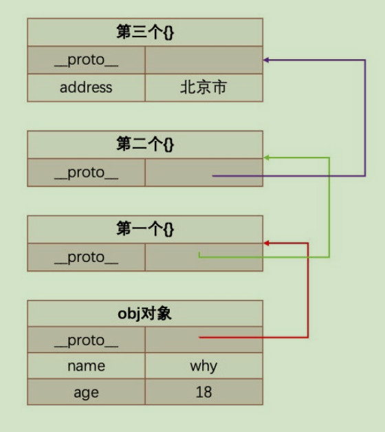

当我们编写如下代码的时候，我们会如何来称呼这个 Person 呢？ 在 JS 中 Person 应该被称之为是一个构造函数；从很多面向对象语言过来的开发者，也习惯称之为类，因为类可以帮助我们创建出来对象 p1、p2；如果从面向对象的编程范式角度来看，Person 确实是可以称之为类的；

<!-- more -->

## 面向对象的特性 – 继承

面向对象有三大特性：封装、继承、多态

- 封装：我们前面将属性和方法封装到一个类中，可以称之为封装的过程；
- 继承：继承是面向对象中非常重要的，不仅仅可以减少重复代码的数量，也是多态前提（纯面向对象中）；
- 多态：不同的对象在执行时表现出不同的形态；

那么这里我们核心讲继承。 那么继承是做什么呢？

继承可以帮助我们将重复的代码和逻辑抽取到父类中，子类只需要直接继承过来使用即可。

那么 JavaScript 当中如何实现继承呢？

不着急，我们先来看一下 JavaScript 原型链的机制；再利用原型链的机制实现一下继承；

## JavaScript 原型链

在真正实现继承之前，我们先来理解一个非常重要的概念：原型链。我们知道，从一个对象上获取属性，如果在当前对象中没有获取到就会去它的原型上面获取：

```js
var obj = {
  name: 'why',
  age: 18,
}

// [[get]]操作
// 1.在当前的对象中查找属性
// 2.如果没有找到, 这个时候会去原型链(__proto__)对象上查找

obj.__proto__ = {}

// 原型链
obj.__proto__.__proto__ = {}

obj.__proto__.__proto__.__proto__ = {
  address: '上海市',
}

console.log(obj.address)
```



## Object 的原型

那么什么地方是原型链的尽头呢？比如第三个对象是否也是有原型 `__proto__` 属性呢？

```js
var obj = { name: 'why' }

// console.log(obj.address)

// 到底是找到哪一层对象之后停止继续查找了呢?
// 字面对象obj的原型是 [Object: null prototype] {}
// [Object: null prototype] {} 就是顶层的原型
console.log(obj.__proto__)

// obj.__proto__ => [Object: null prototype] {}
console.log(obj.__proto__.__proto__)
```

我们会发现它打印的是 [Object: null prototype] {};从 Object 直接创建出来的对象的原型都是 [Object: null prototype] {}。

那么我们可能会问题： [Object: null prototype] {} 原型有什么特殊吗？

- 特殊一：该对象有原型属性，但是它的原型属性已经指向的是 null，也就是已经是顶层原型了；
- 特殊二：该对象上有很多默认的属性和方法；

```js
console.log(Object.getOwnPropertyDescriptors(Object.prototype))
```


## Object 是所有类的父类

从我们上面的 Object 原型我们可以得出一个结论：原型链最顶层的原型对象就是 Object 的原型对象

```js
function Person(name, age) {
  this.name = name
  this.age = age
}

Person.prototype.running = function () {}

const p1 = new Person('why', 18)

p1.running()
p1.valueOf()
p1.toString()
```


## 通过原型链实现继承

如果我们现在需要实现继承，那么就可以利用原型链来实现了：

目前 stu 的原型是 p 对象，而 p 对象的原型是 Person 默认的原型，里面包含 running 等函数；注意：步骤 4 和步骤 5 不可以调整顺序，否则会有问题

```js
// 父类: 公共属性和方法
function Person() {
  this.name = 'why'
  this.friends = []
}

Person.prototype.eating = function () {
  console.log(this.name + ' eating~')
}

// 子类: 特有属性和方法
function Student() {
  this.sno = 111
}

var p = new Person()
Student.prototype = p

Student.prototype.studying = function () {
  console.log(this.name + ' studying~')
}

// name/sno
var stu = new Student()

// console.log(stu.name)
// stu.eating()

// stu.studying()
```


## 原型链继承的弊端

但是目前有一个很大的弊端：某些属性其实是保存在 p 对象上的；

- 第一，我们通过直接打印对象是看不到这个属性的；
- 第二，这个属性会被多个对象共享，如果这个对象是一个引用类型，那么就会造成问题；
- 第三，不能给 Person 传递参数，因为这个对象是一次性创建的（没办法定制化）；

```js
// 原型链实现继承的弊端:
// 1.第一个弊端: 打印stu对象, 继承的属性是看不到的
// console.log(stu.name)

// 2.第二个弊端: 创建出来两个stu的对象
var stu1 = new Student()
var stu2 = new Student()

// 直接修改对象上的属性, 是给本对象添加了一个新属性
stu1.name = 'kobe'
console.log(stu2.name)

// 获取引用, 修改引用中的值, 会相互影响
stu1.friends.push('kobe')

console.log(stu1.friends)
console.log(stu2.friends)

// 3.第三个弊端: 在前面实现类的过程中都没有传递参数
var stu3 = new Student('lilei', 112)
```

## 借用构造函数继承

为了解决原型链继承中存在的问题，开发人员提供了一种新的技术: constructor stealing(有很多名称: 借用构造函
数或者称之为经典继承或者称之为伪造对象)：

steal 是偷窃、剽窃的意思，但是这里可以翻译成借用；

借用继承的做法非常简单：在子类型构造函数的内部调用父类型构造函数.因为函数可以在任意的时刻被调用；因此通过 apply()和 call()方法也可以在新创建的对象上执行构造函数；

```js
function Student(name, friends, sno) {
  Person.call(this, name, friends)
  this.sno = sno
}

Student.prototype = new Person()
```

## 组合继承的问题

组合继承是 JavaScript 最常用的继承模式之一：

如果你理解到这里, 点到为止, 那么组合来实现继承只能说问题不大；但是它依然不是很完美，但是基本已经没有问题了；

组合继承存在什么问题呢?

组合继承最大的问题就是无论在什么情况下，都会调用两次父类构造函数。

- 一次在创建子类原型的时候；
- 另一次在子类构造函数内部(也就是每次创建子类实例的时候)；

另外，如果你仔细按照我的流程走了上面的每一个步骤，你会发现：所有的子类实例事实上会拥有两份父类的
属性

- 一份在当前的实例自己里面(也就是 person 本身的)，另一份在子类对应的原型对象中(也就是
  `person.__proto__`里面)；
- 当然，这两份属性我们无需担心访问出现问题，因为默认一定是访问实例本身这一部分的；

## 原型式继承函数

原型式继承的渊源

这种模式要从道格拉斯·克罗克福德（Douglas Crockford，著名的前端大师，JSON 的创立者）在 2006 年写的
一篇文章说起: Prototypal Inheritance in JavaScript(在 JS 中使用原型式继承);在这篇文章中，它介绍了一种继承方法，而且这种继承方法不是通过构造函数来实现的.为了理解这种方式，我们先再次回顾一下 JavaScript 想实现继承的目的：重复利用另外一个对象的属性和方法.

最终的目的：student 对象的原型指向了 person 对象；

```js
var obj = {
  name: 'why',
  age: 18,
}

var info = Object.create(obj)

// 原型式继承函数
function createObject1(o) {
  var newObj = {}
  Object.setPrototypeOf(newObj, o)
  return newObj
}

function createObject2(o) {
  function Fn() {}
  Fn.prototype = o
  var newObj = new Fn()
  return newObj
}

// var info = createObject2(obj)
var info = Object.create(obj)
console.log(info)
console.log(info.__proto__)
```

## 寄生式继承函数

寄生式(Parasitic)继承

寄生式(Parasitic)继承是与原型式继承紧密相关的一种思想, 并且同样由道格拉斯·克罗克福德(Douglas
Crockford)提出和推广的；

寄生式继承的思路是结合原型类继承和工厂模式的一种方式；即创建一个封装继承过程的函数, 该函数在内部以某种方式来增强对象，最后再将这个对象返回；

```js
var personObj = {
  running: function () {
    console.log('running')
  },
}

function createStudent(name) {
  var stu = Object.create(personObj)
  stu.name = name
  stu.studying = function () {
    console.log('studying~')
  }
  return stu
}

var stuObj = createStudent('why')
var stuObj1 = createStudent('kobe')
var stuObj2 = createStudent('james')
```

## 寄生组合式继承

现在我们来回顾一下之前提出的比较理想的组合继承

组合继承是比较理想的继承方式, 但是存在两个问题:

- 问题一: 构造函数会被调用两次: 一次在创建子类型原型对象的时候, 一次在创建子类型实例的时候.
- 问题二: 父类型中的属性会有两份: 一份在原型对象中, 一份在子类型实例中.

事实上, 我们现在可以利用寄生式继承将这两个问题给解决掉.

- 你需要先明确一点: 当我们在子类型的构造函数中调用父类型.call(this, 参数)这个函数的时候, 就会将父类型中
  的属性和方法复制一份到了子类型中. 所以父类型本身里面的内容, 我们不再需要.
- 这个时候, 我们还需要获取到一份父类型的原型对象中的属性和方法.
- 能不能直接让子类型的原型对象 = 父类型的原型对象呢?
- 不要这么做, 因为这么做意味着以后修改了子类型原型对象的某个引用类型的时候, 父类型原生对象的引用类型
  也会被修改.
- 我们使用前面的寄生式思想就可以了.

```js
function createObject(o) {
  function Fn() {}
  Fn.prototype = o
  return new Fn()
}

function inheritPrototype(SubType, SuperType) {
  SubType.prototype = Objec.create(SuperType.prototype)
  Object.defineProperty(SubType.prototype, 'constructor', {
    enumerable: false,
    configurable: true,
    writable: true,
    value: SubType,
  })
}

function Person(name, age, friends) {
  this.name = name
  this.age = age
  this.friends = friends
}

Person.prototype.running = function () {
  console.log('running~')
}

Person.prototype.eating = function () {
  console.log('eating~')
}

function Student(name, age, friends, sno, score) {
  Person.call(this, name, age, friends)
  this.sno = sno
  this.score = score
}

inheritPrototype(Student, Person)

Student.prototype.studying = function () {
  console.log('studying~')
}

var stu = new Student('why', 18, ['kobe'], 111, 100)
console.log(stu)
stu.studying()
stu.running()
stu.eating()

console.log(stu.constructor.name)
```
